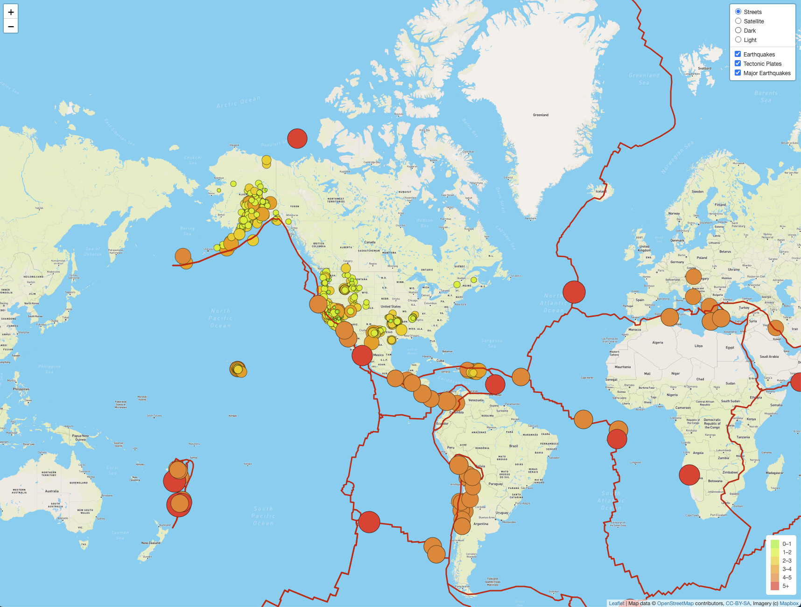
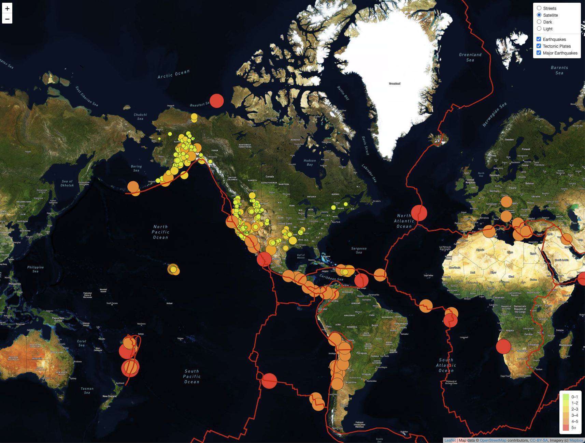
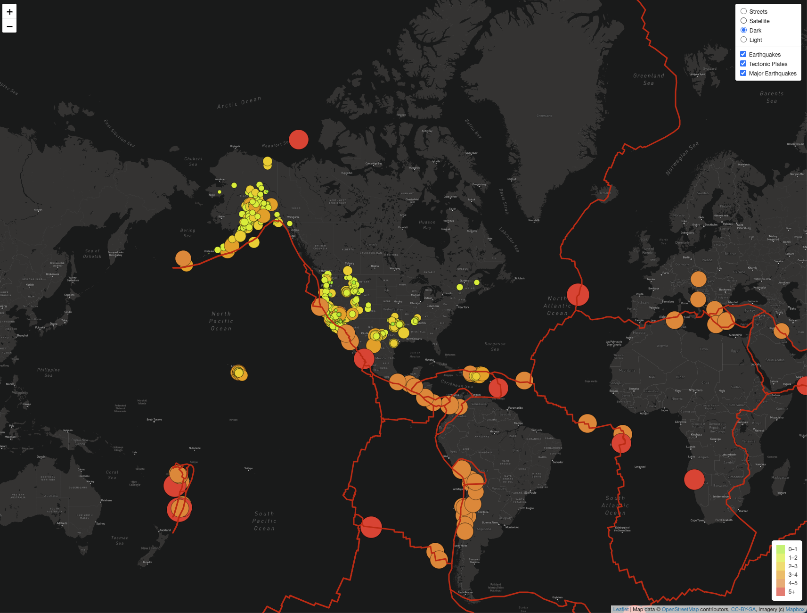
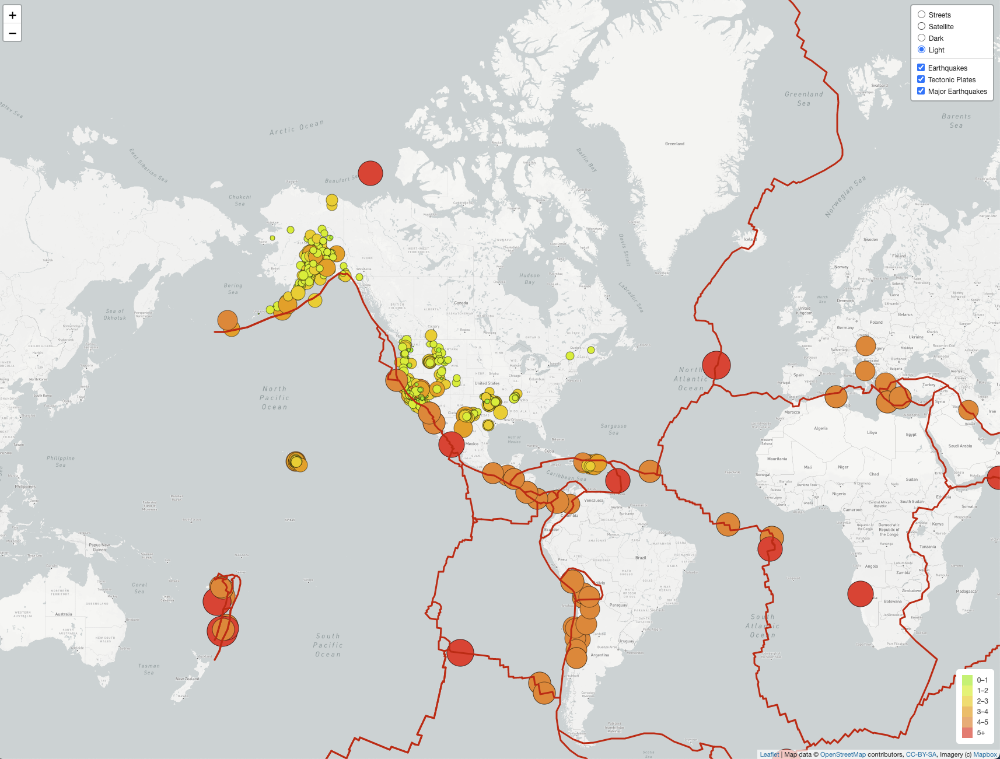

# Mapping_Earthquakes

For this analysis project, I created an interactive world map by using the JavaScript and Leaflet.js Application Programming Interface (API) to populate a geographical map with GeoJSON earthquake data, over the past seven days, from the USGS website. 

Each earthquake is visually represented by a circle and color, where a higher magnitude has a larger diameter and is darker in color. In addition, each earthquake has a popup marker that, when clicked, shows the magnitude of the earthquake and the location of the earthquake.

Next, I added tectonic plate data using the D3 library, added the data using the geoJSON layer, set the tectonic plates LineString data to stand out from the rest of the map, and added the tectonic plate data to the overlay object with the earthquake data.

Then, I included major earthquake data to the map using the D3 library and also set the radius of the circle based on the magnitude of the major earthquake and added a popup marker for each major earthquake that displays the magnitude and location of the major earthquake using the GeoJSON layer.

Lastly, I added two additional map styles, dark and light, using Mapbox for the user to use to go along with the streets and satellite style maps.

## Streets Map

## Satellite Map

## Dark Map

## Light Map

